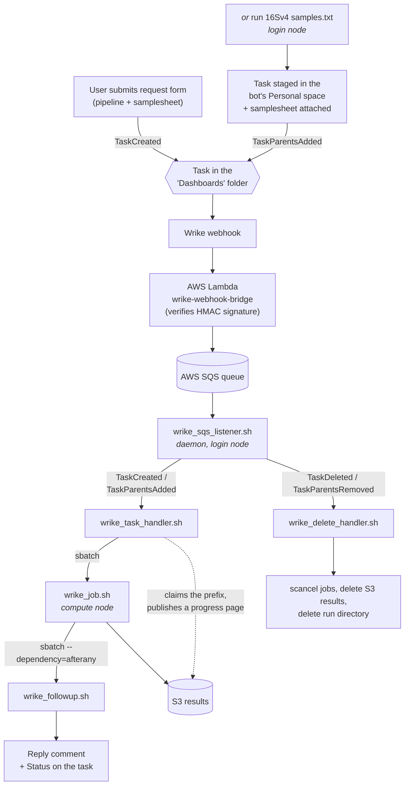

# nextflow


Amplicon (16S) and WGS pipelines for CMMR, driven from Wrike.

A user submits the **"Bioinformatics Pipeline"** Wrike request form, naming a
pipeline and attaching a samplesheet — or runs **`run 16Sv4 samples.txt`** on the
login node, which files the same request. A few seconds later the bot replies on
the resulting task that the job is queued; when it finishes, the task carries a
link to an S3-hosted report and a zip of the raw reads. Everything in between is
what this repository does.

There is no web service and no database. The whole system is bash scripts on the
cluster login node plus a Slurm queue, glued to Wrike by an SQS queue.

---

## How a run happens



1. **Wrike → SQS.** A webhook on the "Dashboards" folder publishes JSON to an API
   Gateway endpoint backed by a Lambda, which checks an HMAC signature against a
   pre-shared secret and pushes the raw body onto SQS. Registration commands,
   example payloads, and the Lambda source are in
   [docs/webhook_bridge.md](docs/webhook_bridge.md).

   **A request arrives as one of two events, because there are two ways into that
   folder.** The request form creates its task there outright, which is
   `TaskCreated`. [`run`](run) builds its task somewhere else first and files it
   afterwards, which is `TaskParentsAdded`. They mean the same thing and go to the
   same handler.

2. **SQS → handler.** [`wrike_sqs_listener.sh`](scripts/wrike_sqs_listener.sh) runs
   forever on the login node, long-polling SQS. It deletes each message before
   dispatching it (so a crashed handler can't cause the same job to run twice) and
   routes on `eventType`. Handlers are backgrounded so a slow one never stalls
   polling. It pauses entirely while Slurm is unreachable. It runs under systemd
   as a user unit; installing and supervising it is
   [docs/daemon.md](docs/daemon.md).

   `TaskCreated` is unambiguous — a task appearing in that folder is a request.
   The two parent events are not, because they fire for *any* parent change on a
   task the webhook can see, so both are checked against
   `WRIKE_DASHBOARDS_FOLDER_ID` before being acted on. The payload field is
   `addedParents` / `removedParents`; getting that name wrong fails silently, as
   the check simply never matches.

3. **Validation.** [`wrike_task_handler.sh`](scripts/wrike_task_handler.sh)
   is deliberately lightweight — it does no real work, only checks. **Every
   failure replies to the user on the Wrike task and exits 0** — a rejected
   request is a normal outcome, not a daemon error.

   **It gives the run its two homes before it checks anything about the
   request.** As soon as the task ID yields a uid it creates
   `$NEXTFLOW_DIR/tmp/<uid>/` — recording the task ID and title in
   `wrike_task_id.txt` and `wrike_task_name.txt` there — confirms the matching S3
   prefix is unpublished, claims it by uploading a `Validating` progress page,
   and writes that page's address to the task's results custom field. From that
   point the requester has a live link and the handler has somewhere durable to
   say whatever it has to say. Creating the directory with plain `mkdir` is also
   the idempotency guard: SQS delivers at least once, and a redelivered event
   would otherwise put a second pipeline behind the same uid. It also covers the
   case of a task that somehow produces both entry events.

   Then the checks: is the pipeline named in the task's custom field a real
   pipeline? is exactly one samplesheet attached, with a plausible extension?
   The pipeline field is free text, so users can pin an exact version
   (`16Sv4_01`) rather than only picking from the form's dropdown. It is
   therefore validated as a *name* — `^[A-Z0-9_]+$`, then a file that exists —
   before it is ever used as a path, because `wrike_job.sh` sources what it
   resolves to.

   A rejected request keeps both homes, its page now reading `Failed`; they last
   as long as the Wrike task does. The one exception is the S3 prefix collision,
   which cleans up after itself because neither the prefix nor the directory it
   would have used is its own — they belong to whichever run got there first.
   Collisions are rejected like any other bad request, since a new task derives a
   new uid.

   On success it submits two Slurm jobs and re-publishes the page as `Queued`.

4. **The run.** [`wrike_job.sh`](scripts/wrike_job.sh) downloads the samplesheet,
   sources the requested pipeline definition, and runs its three stages:
   pre-process → nextflow → post-process. It never comments on Wrike itself; it
   records progress in `status.txt` and any user-facing explanation in
   `message.out`.

5. **The report.** [`wrike_followup.sh`](scripts/wrike_followup.sh) is submitted
   with `--dependency=afterany`, so it runs whether the job succeeded, failed, or
   was killed by the scheduler. It reads `status.txt` and `message.out` out of the
   run directory and posts the outcome. A successful run's directory is deleted
   (results are already in S3); a failed one is kept for inspection.

6. **Teardown.** Removing the "Dashboards" tag from a task, or deleting the task,
   fires the same webhook. [`wrike_delete_handler.sh`](scripts/wrike_delete_handler.sh)
   cancels any Slurm jobs for that task, purges its S3 prefix, and removes the run
   directory. Every step is best-effort, because a run may never have created the
   thing being removed.

   It checks *which* parent was removed before destroying anything. A task can sit
   in several folders at once — every task `run` submits keeps its staging space
   as a parent — and unfiling one of those must not tear down a run that is still
   on the dashboard.

### Conventions worth knowing up front

These carry most of the system's state, and nothing works if you break them:

- **The uid is the primary key; the Wrike task ID is what it is derived from.**
  A run's *uid* is eight base32 characters — `derive_uid` HMACs the Wrike task ID
  with `RUN_ID_SALT` — and it names the run directory (`tmp/<uid>`), the Slurm
  `--job-name` of both jobs, and the S3 prefix (`nxf/<uid>/`) the results are
  published under. Eight characters is short enough to keep a results URL
  readable and only safe because `wrike_task_handler.sh` checks S3 for the prefix
  before accepting a request: a collision is a rejected request, not one
  client's results landing on another's.
  Anything holding a task ID can recompute the uid, which is what lets
  `wrike_delete_handler.sh` find a run to tear down when the task it belonged to
  no longer exists. The Wrike task ID cannot serve as any of those names itself:
  Wrike may issue IDs containing `:` and `=`, which S3 wants URL-encoded and
  Apptainer reads as bind-spec separators, and at up to 256 characters they can
  outrun a 255-byte path component.
- **The derivation runs one way only.** A uid does not lead back to a task, so
  `wrike_task_handler.sh` writes the task ID to `wrike_task_id.txt` in the run
  directory, and everything on the compute node reads it back with
  `read_wrike_task_id` rather than recovering it from `$PWD`. Scripts that only
  need the uid take it from `$PWD` — it is the directory's name.
- **The run directory is the message bus.** `status.txt` (last stage reached;
  `Completed` only on success) and `message.out` (optional user-facing text) are
  how a compute node tells `wrike_followup.sh` what happened. `message.out` is
  created empty with the run directory, and the `fail` helper writes to it
  wherever it finds it — which is what makes any script in the run, down to a
  pipeline's own pre- and post-process steps, able to explain itself to the
  requester without knowing anything about Wrike.
- **`nextflow_command.sh` is the record.** `wrike_job.sh` writes the fully
  expanded nextflow command to that file and then executes it, rather than
  running nextflow directly — so the record can never drift from what actually
  ran. It is copied into the published results.

---

## Repository layout

```
.env                  Non-secret environment; sources secrets/.env, utilities.sh,
                      and wrike_api.sh. Sourced by every script here; does not
                      touch PATH.
secrets/.env          Wrike token and AWS credentials. Credentials only; not in git.
run                   CLI entry point. Files a Wrike request, then gets out of the way.

scripts/
  utilities.sh             log, warn, fail, and the uid helpers. Sourced by .env.
  wrike_api.sh             Wrike REST helpers and object IDs. Likewise sourced.
  wrike_sqs_listener.sh    The daemon. Polls SQS, routes events.
  wrike_task_handler.sh    Validates a form request, submits it. Login node.
  wrike_delete_handler.sh  Tears a run down. Login node.
  wrike_job.sh             Runs one pipeline end to end. Slurm batch job.
  wrike_followup.sh        Reports the outcome to Wrike. Slurm batch job.
  nextflow_progress.sh     Publishes the live progress page. Backgrounded by wrike_job.sh.
  index_directories.sh     Writes a listing page into every results folder. Pipeline-agnostic.
  ampliseq_samplesheet.sh  PRE_PROCESS_CMD for the ampliseq pipelines.
  ampliseq_upload.sh       POST_PROCESS_CMD for the ampliseq pipelines.
  taxprofiler_samplesheet.sh  PRE_PROCESS_CMD for the taxprofiler pipelines.
  taxprofiler_upload.sh       POST_PROCESS_CMD for the taxprofiler pipelines.

pipelines/            One file per pipeline; see below.
config/               Nextflow config, passed to `nextflow run -c`.
  slurm.config        Executor + apptainer settings used by the pipelines.
  local.config        Same, for running off the scheduler.
  taxprofiler/
    database.csv      Database sheet for the taxprofiler pipelines.
    slurm.config      Executor + apptainer settings for the taxprofiler pipelines.

templates/            Web pages published to S3 alongside a run's results.
  progress.html       Live progress page template. Pipeline-agnostic.
  listing.html        Folder listing page template. Likewise.
  ampliseq/
    index.html        Landing page template for a published ampliseq run.
  taxprofiler/
    index.html        Landing page template for a published taxprofiler run.

systemd/              The daemon's supervisor.
  wrike-sqs-listener.service  systemd user unit for wrike_sqs_listener.sh.

images/               Assets that are not part of any published page.
  bot_100px.png       Cluster Bot's Wrike avatar. The small one is in this README.
  bot_large.png       Full size, kept so the avatar can be reused elsewhere.

docs/                 How the daemon and the external services were set up.
  daemon.md           Installing, supervising, and troubleshooting the daemon.
  webhook_bridge.md   Wrike webhook registration and the AWS Lambda source.
  cloudfront.md       Viewer request function that serves the listing pages.
  wrike_responses.md  Wrike API responses for the request form and its fields.
```

Working directories that exist only on the cluster: `assets/`, `bin/`, `cache/`,
`db/` (gitignored), plus `log/` and `tmp/` (created at runtime).

---

## Pipelines

A pipeline file is **not** a script — it is a set of variable assignments that
`wrike_job.sh` sources:

| Variable | Required | Purpose |
| --- | --- | --- |
| `NEXTFLOW_ARGS` | yes | Bash array; the full nextflow command line, already split |
| `PIPELINE_NAME` | no | Exact version recorded on the Wrike task, e.g. `16Sv4_01` |
| `PRE_PROCESS_CMD` | no | Runs before nextflow, in the run directory |
| `POST_PROCESS_CMD` | no | Runs after nextflow succeeds |

Sourcing (rather than executing) is what lets a pipeline file also write its own
params file as a side effect — see the `cat << EOF > ampliseq_args.yaml` block in
any of the `_01` files.

**Each versioned pipeline pins its own nextflow arguments as well as its params.**
Nothing about the command line is defaulted by `wrike_job.sh`. That is the point:
re-running `16SV4_01` a year from now reproduces this run exactly.

### Naming

Two names resolve to the same run, by chained `source`:

```
16SV4.sh  →  16SV4_01.sh      (the actual definition)
```

`16SV4_01.sh` is immutable once it has been used in production. To change
parameters, add `16SV4_02.sh` and repoint `16SV4.sh` at it; old tasks keep
reproducing their original run. The request form's pipeline field is matched
case-insensitively (`16sv4` works) and the resolved name is uppercased, so a user
who needs a specific version can type `16Sv4_01` instead of taking the dropdown's
default.

Currently defined: **16SV1V3** (27f/534r), **16SV3V5** (357f/926r),
**16SV4** (515f/806r), **16SV5V6** (806f/1053r) — all nf-core/ampliseq 2.18.0
against SILVA 138.2 — and **TAXPROFILER**, nf-core/taxprofiler 2.0.1 running
kraken2, bracken and metaphlan over shotgun reads.

**Pipeline files are named in upper case.** `wrike_task_handler.sh` uppercases
whatever the user typed and looks for exactly that filename, so `taxprofiler` on
the form resolves to `pipelines/TAXPROFILER.sh` and a lower-case file would never
be found.

### Adding a pipeline

1. Write `pipelines/<NAME>_01.sh` setting the variables above.
2. Add `pipelines/<NAME>.sh` containing
   `source "$NEXTFLOW_DIR/pipelines/<NAME>_01.sh"`.
3. Add `<NAME>` as an option to Wrike's "Pipeline Name" custom field.

---

## The ampliseq pre/post steps

[`ampliseq_samplesheet.sh`](scripts/ampliseq_samplesheet.sh) turns the lab's
whitespace-delimited `sample fastq_1 fastq_2` sheet into what ampliseq requires:
it recompresses `.bz2` and plain FASTQ to `.gz`, merges entries sharing a sample
name, and sanitizes names to `[A-Za-z][A-Za-z0-9_]*`. Everything lands in
`raw-sequences/` as `<sample>_{1,2}.fq.gz`; already-gzipped inputs are symlinked
rather than copied, so the directory is nearly free in the common case. It also
derives ampliseq's `run` column by hashing each sample's source directory, which
groups samples that were sequenced together for error-model training. It records
the post-merge sample count in `sample_count.txt` for the results page to show.

[`ampliseq_upload.sh`](scripts/ampliseq_upload.sh) zips `raw-sequences/` into the
results folder (`zip -0` — the reads are already compressed), gives every folder
in it a listing page, uploads the folder to `s3://$AWS_S3_BUCKET/nxf/<uid>/`, and
writes the report URL to a Wrike custom field. Nextflow's `work/` directory is
deliberately left behind.

Everything published lives under one `nxf/` prefix (`S3_RUN_PREFIX` in `.env`),
so that runs do not crowd the top of the bucket and a site can be built around
them later.

### The results page

The URL handed to the requester is `index.html`, not the report itself.
[`templates/ampliseq/index.html`](templates/ampliseq/index.html) is a template that
`ampliseq_upload.sh` fills in and uploads last, once everything it links to is
in place: a fixed header carrying the Wrike task name, the date, and download
buttons, above an iframe holding `summary_report/summary_report.html`. Every
link in it is relative, because it is served from S3 alongside the objects it
points at.

The task name is re-read from Wrike at upload time rather than taken from the
`wrike_task_name.txt` copy recorded at submission, since the requester may have
renamed the task since filing it. That copy is the fallback, and a generic
heading the one after that.

The buttons are built from files that actually exist under `results/`, not from
a fixed list — qiime2 steps can be skipped, and `raw-sequences.zip` only exists
for pipelines that stage their reads. Each is labelled with its own filename, so
a reader knows what they are getting and can recognize it once it lands:

| Button | File |
|---|---|
| `raw-sequences.zip` | the reads `ampliseq_samplesheet.sh` staged, zipped at upload |
| `feature-table.biom` | `qiime2/abundance_tables/feature-table.biom` — the ASV abundance table, carrying taxonomy as observation metadata |

The header also carries the sample count, taken from `sample_count.txt`, which
`ampliseq_samplesheet.sh` writes into the run directory. That is the count
*after* merging entries that share a sample name, so it is the number of samples
the run actually analysed rather than the number of lines the requester
submitted. A run without that file simply leaves the figure out.

**That page starts as a live progress view.**
[`nextflow_progress.sh`](scripts/nextflow_progress.sh), backgrounded by
`wrike_job.sh` for the length of the nextflow stage, renders
[`templates/progress.html`](templates/progress.html) to the *same key* every minute —
so a requester who opens the results link early watches the pipeline work. The
final upload overwrites it.

The link is live before any of that — before the request has even been checked
over. `wrike_task_handler.sh` claims the run's S3 prefix by publishing a
`Validating` page to it, writes that address to the task's results custom field,
and then re-publishes at each point the answer changes: `Queued` once Slurm has
taken the job, `Failed` if the request is rejected or never reaches the queue.
So the link on the task leads somewhere from the first few seconds rather than
to a `NoSuchKey`, and what it leads to agrees with the task's own Status. Every
one of those steps is best-effort — a page is not worth rejecting a good request
or abandoning a queued run over. `ampliseq_upload.sh` sets the same field again
at the end, which covers a failure earlier on and marks the point where the
address stops being a promise. All of them build it through `run_results_url`,
so a task can never point somewhere its results are not.

The prefix is deleted only by `wrike_delete_handler.sh`, when the task it belongs
to is deleted or unfiled. A request that failed keeps its page saying so.

The numbers come from parsing nextflow's console output, which `wrike_job.sh`
tees to `nextflow.out`. Nextflow has no live status API outside Seqera Platform:
its trace file only records tasks that have already finished, and its HTML report
is written once at the end. What it does emit continuously is the same process
table an interactive terminal shows — one line per change, since ANSI output is
off in a batch job — so the table is those lines, last one per process winning.
That is not a stable interface, so every failure in that script is soft: a page
that cannot be built is skipped, and nothing about the run depends on it.

The progress page refreshes itself every minute and the finished report does
not, which is what stops a reader's browser polling once the results land.

### Browsable folders

The report links to folders as well as to files, and S3 serves objects rather
than directories, so those links land on nothing once the results are published.
[`index_directories.sh`](scripts/index_directories.sh) fills that gap in before
the upload: it walks the results folder and renders
[`templates/listing.html`](templates/listing.html) into every subdirectory below it,
listing what that folder holds — subfolders first, then files with their sizes,
every entry linked, and a link back up. Names are HTML-escaped for the page and
percent-encoded for the href beside it, a byte at a time, since a filename is
bytes and a `#` in one would otherwise cut its own link short.

**Those pages are only reachable because CloudFront maps a folder URL onto the
`index.html` beneath it.** A viewer request function does it — see
[docs/cloudfront.md](docs/cloudfront.md) — and without it every folder link in a
report is a 404, whatever `index_directories.sh` wrote.

A directory that already carries an `index.html` keeps it, so pages the pipeline
published itself are left alone and a second pass over the same results folder
changes nothing. The results folder itself is skipped — that `index.html` is the
landing page above, which goes up last. Like the progress page, none of this is
worth failing a run over: results nobody can browse are still results.

---

## The taxprofiler pre/post steps

[`taxprofiler_samplesheet.sh`](scripts/taxprofiler_samplesheet.sh) turns the same
lab sheet into the six-column CSV taxprofiler wants — `sample`,
`run_accession`, `instrument_platform`, `fastq_1`, `fastq_2`, `fasta`. It differs
from the ampliseq converter in two ways that follow from what taxprofiler can do
for itself:

- **Duplicate sample names are not merged.** taxprofiler concatenates a sample's
  runs itself, after per-run QC, so entries sharing a sample name become separate
  rows numbered `run_1`, `run_2`, … The count in `sample_count.txt` is therefore
  *distinct samples*, not rows.
- **Already-gzipped inputs are referenced where they lie.** taxprofiler reads
  gzipped FASTQ only, so `.bz2` and plain FASTQ are still recompressed into
  `raw-sequences/` — but a WGS run's inputs are normally `.gz` already, and
  staging tens of gigabytes to symlink them buys nothing. `raw-sequences/` is
  removed again when it turns out to be empty.

`instrument_platform` is written as `ILLUMINA` unless the pipeline definition
sets `INSTRUMENT_PLATFORM`, which is what a long-read version would change.

[`taxprofiler_upload.sh`](scripts/taxprofiler_upload.sh) is the ampliseq uploader
without the reads archive: it indexes the results folders, copies them to
`s3://$AWS_S3_BUCKET/nxf/<uid>/`, renders
[`templates/taxprofiler/index.html`](templates/taxprofiler/index.html) over
`multiqc/multiqc_report.html`, and writes the report URL to the Wrike custom
field. Publishing a client's WGS reads would mean uploading the same tens of
gigabytes to S3, so it does not.

Its buttons are globbed rather than listed, since the filenames carry the tool
and database names from `database.csv`:

| Button | Files |
|---|---|
| krona charts | `krona/*.html` — opened in a new tab rather than downloaded |
| taxpasta tables | `taxpasta/*.tsv` — one merged profile per tool and database |

### Databases and resource limits

taxprofiler takes its databases from a second sheet,
[`config/taxprofiler/database.csv`](config/taxprofiler/database.csv), naming a
kraken2 database, a bracken database over the same path, and a metaphlan4
database under `/biolib/prod/db`. **Bracken's `db_params` must contain a
semicolon**, which splits kraken2's parameters from bracken's — `;-r 150` is
default kraken2 settings with a 150 bp read length.

It also has its own
[`config/taxprofiler/slurm.config`](config/taxprofiler/slurm.config) rather than
sharing `config/slurm.config`. taxprofiler 2.0.1 is built on the nf-core 3.x
template, which dropped `params.max_cpus` / `max_memory` / `max_time` in favour
of `process.resourceLimits`; the `params` block in `config/slurm.config` sets
nothing taxprofiler reads.

Kraken2 and MetaPhlAn are sized against the node rather than left on nf-core's
`process_high` label. Kraken2 reads `hash.k2d` — 74 GB for
`bac_arc_fun_Feb2024` — into its own heap, which is above the label's default;
16 cpus each puts two of either on a 32-core node and uses every core. Nothing
copies a database: Nextflow stages inputs as absolute symlinks
(`stageInMode` defaults to `symlink`) and `scratch` copies only declared
*outputs* back, so both tools read the database over the shared filesystem and
the first task on a node warms the page cache for the rest.

Only five files in the kraken2 directory are read at run time — `hash.k2d`,
`opts.k2d`, `taxo.k2d`, `seqid2taxid.map`, and Bracken's
`database150mers.kmer_distrib`. `database.kraken` (61 GB) and `library/` are
build artifacts. **Do not delete them**: `bracken-build` needs `database.kraken`
to produce `kmer_distrib` files for read lengths other than 150.

---

## Configuration

Every script that talks to Wrike or AWS begins with
`source /data/prod/nextflow/.env`. Every statement in that file is a plain
assignment or a `source`, so it is safe and cheap to source any number of times,
in any process, and it carries no guard. It sets `NEXTFLOW_DIR`, sets the
nextflow cache directories, unsets any `WRIKE_API_TOKEN` inherited from the
caller, and then sources three things:

- `secrets/.env` — **credentials only**, never committed:
  - `WRIKE_API_TOKEN` — the bot's, and the only one anything here uses. `.env`
    **unsets any inherited `WRIKE_API_TOKEN` before sourcing this file**, so a
    token exported by whoever invoked `run` cannot stand in for the bot's; see
    "Running a pipeline by hand" below.
  - `AWS_ACCESS_KEY_ID`, `AWS_SECRET_ACCESS_KEY`, `AWS_REGION`, `AWS_DEFAULT_REGION`
  - `AWS_SQS_QUEUE_URL`, `AWS_S3_BUCKET`
  - `RUN_ID_SALT` — the HMAC key `derive_uid` derives uids with. Secret because the
    uid is the whole address of a client's results: without it, anyone holding a
    Wrike task ID could compute where that task published. **Changing it strands
    every published result and every in-flight run**, since teardown recomputes
    the uid rather than looking it up.
  - `WRIKE_WEBHOOK_SECRET`, `AWS_WEBHOOK_BRIDGE` (used when registering webhooks)
- [`scripts/utilities.sh`](scripts/utilities.sh) — `log`, `warn`, and `fail`, the
  three ways anything in this system says anything. All stamp the time.
  `log` goes to stdout while `warn` and `fail` go to stderr — which keeps stdout
  free to carry a function's return value, since several helpers hand their
  result back through `$(…)`. `fail` also copies itself to `message.out` when
  that file exists, and exits non-zero, so a caller stops on the spot rather than
  having to check. Also `derive_uid`, which turns a Wrike task ID into the
  8-character base32 uid that names the run everywhere outside Wrike — 40 bits,
  HMAC-SHA256, so it is stable, unguessable, and safe in a path and a URL, none
  of which a raw Wrike ID is — plus `is_valid_uid`, which every script that
  builds a path or an S3 prefix out of one checks first, `escape_html`, for the
  task name that heads both published pages, and `run_results_url`, the one
  place the address written onto a Wrike task is spelled.
- [`scripts/wrike_api.sh`](scripts/wrike_api.sh) — `call_wrike_api` plus the
  `update_wrike_*` / `add_wrike_task_comment` helpers, which read `TASK_ID` from
  the environment rather than taking it as an argument. **It also defines every
  Wrike object ID the system works against:**
  - `WRIKE_DASHBOARDS_FOLDER_ID` — the folder the webhook watches
  - `WRIKE_PIPELINE_NAME_CFID`, `WRIKE_S3_RESULTS_URL_CFID` — custom fields the
    bot writes the pipeline name and results URL into, which is part of what the
    Wrike Dashboards view renders
  - `WRIKE_CUSTOM_STATUS_IDS` — the status map described below
  - `WRIKE_NXFPIPE_SPACE_ID`, `WRIKE_NXFPIPE_WORKFLOW_ID`,
    `WRIKE_NXFPIPE_REQUEST_FORM_ID` — not read by the running system; they are
    what you need to re-inspect the workflow and form, as
    [docs/wrike_responses.md](docs/wrike_responses.md) does

**`.env` deliberately does not touch `PATH`.** Everything in this project is
invoked by its absolute path — `"$NEXTFLOW_DIR/scripts/wrike_job.sh"`, and
likewise for the handlers the daemon dispatches and the `PRE_PROCESS_CMD` /
`POST_PROCESS_CMD` a pipeline names. That costs a little verbosity and buys two
things: a bare word in these scripts is recognizably a shell function rather
than an executable, and nothing depends on an inherited `PATH` being right —
including `sbatch`, whose willingness to search `PATH` for a batch script varies
by version.

  These are opaque references, useless to anyone without a token, so they belong
  in git beside the code that uses them. Keeping them in `secrets/.env` would
  mean a fresh clone had no way to reconstruct them.

`WRIKE_PIPELINE_NAME_CFID` is read as well as written: it is the field the
request form fills in with the user's chosen pipeline, and what
`wrike_task_handler.sh` reads to find out what to run. The bot then writes back
over it — first with the resolved name, then with the exact version that ran.

### Progress is the task's Status

How far a run has got is reported as the task's own **Status**, not as a custom
field, so the board groups jobs by what they are actually doing:

```
Submitted → Validating → Queued → Initializing → Pre-Processing → Running → Post-Processing → Completed / Failed
```

`Submitted` is where a request starts: the form leaves its task there, and
[`run`](run) sets it explicitly when creating the task. `Validating` covers the
handler's pre-Slurm sanity checks. Everything from `Queued` on is set from inside
a run directory.

Two helpers do this, and the difference matters. `update_wrike_task_status` sets
the status alone; `update_wrike_pipeline_progress` also writes `status.txt`,
which `wrike_followup.sh` reads to find out how far the run got. The first two
stages happen before any run directory exists, so they use the former — a
`status.txt` written from wherever the user happened to invoke `run` would be
litter at best.

Wrike sets a status by ID, not by name, and those IDs are fixed properties of the
"Nextflow Pipeline Workflow". Resolving them at runtime meant a `GET /workflows`
in every process that reported progress, so **the name → ID mapping is hardcoded
in `WRIKE_CUSTOM_STATUS_IDS`** at the top of
[`scripts/wrike_api.sh`](scripts/wrike_api.sh). The account is rate limited to
400 calls a minute; reporting progress now costs nothing but the `PUT` itself.

**That map is a copy of state that lives in Wrike, so editing the workflow
desyncs it.** Regenerate it from the live workflow — the full response is kept in
[docs/wrike_responses.md](docs/wrike_responses.md):

```bash
call_wrike_api GET "/spaces/$WRIKE_NXFPIPE_SPACE_ID/workflows"
```

A stage name that isn't a key of the map is logged and skipped, deliberately:
losing a progress update is not worth killing a twelve-hour pipeline over, and
`status.txt` records the stage either way. So a rename in Wrike shows up only in
the daemon log:

```
WARNING: No Wrike custom status is mapped to "Pre-Processing"; progress not reported.
```

The workflow also defines `Archived` and `Cancelled`. Both are mapped and
available, but nothing sets them yet.

### The Wrike side

A bot account exists under `dpsmith@bcm.edu` ("Cluster Bot", `KUAYXHNY`),
distinct from Daniel's normal `Daniel.Smith@bcm.edu` account.

**The bot is a regular user**, so it holds a license seat and everything in this
system runs as it: commenting, attaching files, writing custom fields, setting
task status, and creating tasks — which is what lets [`run`](run) file a request
on a caller's behalf rather than making every user bring a token of their own.

It was a Collaborator until August 2026. That costs no seat, but Collaborators
may not create tasks (`403 not_allowed`, a license restriction rather than a
permission grantable on the folder) *or edit custom fields* — and a rejected
custom field write comes back `200` with the change quietly dropped, which is why
`update_wrike_custom_field` reads the reply back and warns when Wrike did not
apply what it was asked for.

To check which account a token belongs to:

```bash
curl -sS -H "Authorization: bearer $WRIKE_API_TOKEN" "https://www.wrike.com/api/v4/contacts?me=true" | jq '.data[0].profiles'
```

A "Nextflow Pipelines" space holds the
"Dashboards" folder that tracks every submitted job, and the "Bioinformatics
Pipeline" request form that creates tasks in it — see
[docs/wrike_responses.md](docs/wrike_responses.md) for the form's definition. Everything
the bot sees, it sees because the request form put it in that folder.

---

## Operating it

The daemon is the only long-lived process. It never returns, and handles
`INT`/`TERM` cleanly, so it runs under systemd as a **user** unit —
[`systemd/wrike-sqs-listener.service`](systemd/wrike-sqs-listener.service).
Nothing here needs root, and lingering is what keeps the unit alive once you log
out. Installation, the environment the unit has to carry in place of
`module load slurm`, and what to check when it will not start are in
[docs/daemon.md](docs/daemon.md).

```bash
systemctl --user status wrike-sqs-listener
```

`log` and `warn` write to stdout and stderr, so the journal is the daemon log:

```bash
journalctl --user -u wrike-sqs-listener -f
```

Restarting picks up edits to `.env` and to the files it sources, both read once
at startup; a change to a handler script needs nothing, since the daemon
executes it fresh per message:

```bash
systemctl --user restart wrike-sqs-listener
```

Slurm output goes to `$NEXTFLOW_DIR/log/job_<uid>_<jobid>.out` and
`followup_<uid>_<jobid>.out` — one file per run, since `--job-name` is the
uid, and one file per job rather than two, since `--output` and `--error`
name the same path and both streams interleave there. Per-run state lives in
`$NEXTFLOW_DIR/tmp/<uid>/`, which is created as soon as a request is picked up
and removed only when its job succeeds or its Wrike task goes away: a directory
still present after a run ended means the run failed or the request was never
accepted, and `status.txt`, `message.out`, and `nextflow.log` there say why —
with `wrike_task_id.txt` naming the Wrike task it came from, since the uid does
not lead back to one.

### Running a pipeline by hand

Nothing to set up: `run` acts as the bot, like everything else here, and the bot
may create tasks.

```bash
/data/prod/nextflow/run 16Sv4 /path/to/somesamples.txt
```

The task it files is therefore authored by the bot **on the caller's behalf**,
and `$(whoami)` goes into the task description — the only record of who asked,
since a command-line request has no browser session behind it.

**Personal Wrike tokens are not used, and cannot be.** `.env` unsets any
`WRIKE_API_TOKEN` in the environment before sourcing the bot's, so exporting one
changes nothing about what `run` does. Every request is the bot's to answer for,
which is what keeps a submission's rights and its history the same for everyone —
rather than depending on the Wrike account whoever ran the command happens to
hold, and on that account still existing when someone comes back to the task.

[`run`](run) does not run a pipeline. It builds the same task the request form
builds — pipeline in the custom field, samplesheet attached — files it under
"Dashboards", and then stops. The request is picked up by
`wrike_task_handler.sh` like any other. Nothing downstream can tell a
command-line request from a form submission, which is the whole idea: there is
one code path and one set of failure modes, not two.

It prints the task ID and permalink and exits as soon as the request is filed.
Progress, rejections, and the final result all show up on that task, not in your
terminal.

**It stages the task in the bot's Personal space first.** Create it there, attach
the samplesheet, *then* add "Dashboards" as a parent. Nothing watches the bot's
own space, so this buys two things:

- **No attachment race.** The samplesheet is always in place before the webhook
  fires, so the handler never has to wait for it. (A form submission still can
  race — Wrike delivers the task and its attachment as separate events with no
  promised order — which is why the handler retries for a few seconds.)
- **Clean rollback.** A failure before the move leaves a task nothing downstream
  has ever seen, so `run` just deletes it. Once the task is on the dashboard,
  failures belong to the bot and get reported on the task instead.

The staging space is deliberately *left* as a parent. Removing it would fire
`TaskParentsRemoved`, and `wrike_delete_handler.sh` listens for that.

This is also why the Wrike task ID being the primary key for everything (run
directory, job name, S3 prefix, and the target of every `update_wrike_*` call)
stopped being an obstacle for a CLI: `run` gets a real task ID by creating a real
task, so nothing needs a synthetic ID or a way to no-op the Wrike reporting.

**On "submitting the request form":** Wrike's API cannot do that.
[`/request_forms`](https://developers.wrike.com/api/v4/request-forms/) is
read-only and form submission is UI-only, regardless of what the bot account is
permissioned to do in the browser. But a request form is only a template for a
task in a folder, so `run` builds that task directly — `POST /folders/<id>/tasks`,
`POST /tasks/<id>/attachments`, then `PUT /tasks/<id>` with `addParents`. The
result is identical from the webhook down.

`run` validates the pipeline name and the samplesheet locally first, using the
same rules as the handler, so an obvious mistake fails in your terminal instead
of a round trip through Wrike.

### Requirements on the cluster

Two live in `$NEXTFLOW_DIR/bin` and are invoked by absolute path: **`nextflow`**
and **`lbzip2`** (the latter only for `.bz2` inputs). The rest are expected on
`PATH`: `apptainer`, Slurm (`sbatch`/`squeue`/`scancel`/`sinfo`), `jq`, `curl`,
`aws` CLI, `pigz`, `md5sum`, and `zip`.
Bash 5.1+ (the scripts use `${var^^}`, `${var,,}`, and associative arrays).
`jq` and `curl` are needed on the compute nodes as well as the login node,
because the Wrike helpers run there too.

---

## Reading the code

Every script carries a header block naming its caller, what it submits, what it
requires, and which environment variables it expects. Start with
[`wrike_task_handler.sh`](scripts/wrike_task_handler.sh) — it is the whole
system's front door, and its numbered steps are the request lifecycle.
