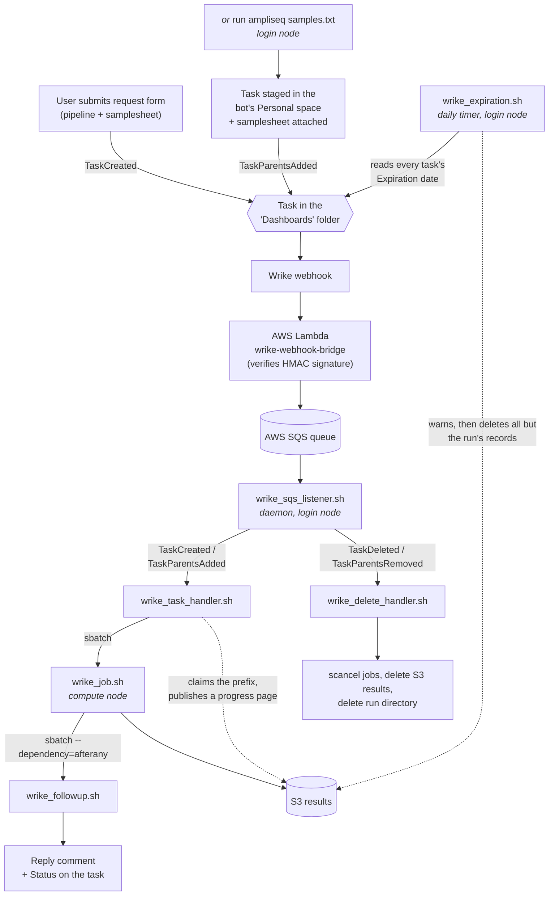

# Overview

Amplicon (16S) and WGS pipelines for CMMR, driven from Wrike.

A user submits the **"Bioinformatics Pipeline"** Wrike request form, naming a
pipeline and attaching a samplesheet — or runs **`run ampliseq samples.txt`** on the
login node, which files the same request. A few seconds later the bot replies on
the resulting task that the job is queued; when it finishes, the task carries a
link to an S3-hosted report and a zip of the raw reads. Everything in between is
what this repository does.

There is no web service and no database. The whole system is bash scripts on the
cluster login node plus a Slurm queue, glued to Wrike by an SQS queue.

## How a run happens

1. **Wrike → SQS.** A webhook on the "Dashboards" folder publishes JSON to an API
   Gateway endpoint backed by a Lambda, which checks an HMAC signature against a
   pre-shared secret and pushes the raw body onto SQS. Registration commands,
   example payloads, and the Lambda source are in
   [the webhook bridge](wrike/webhook_bridge.md).

   **A request arrives as one of two events, because there are two ways into that
   folder.** The request form creates its task there outright, which is
   `TaskCreated`. [`run`](../run) builds its task somewhere else first and files it
   afterwards, which is `TaskParentsAdded`. They mean the same thing and go to the
   same handler.

2. **SQS → handler.** [`wrike_sqs_listener.sh`](../scripts/wrike_sqs_listener.sh) runs
   forever on the login node, long-polling SQS. It deletes each message before
   dispatching it (so a crashed handler can't cause the same job to run twice) and
   routes on `eventType`. Handlers are backgrounded so a slow one never stalls
   polling. It pauses entirely while Slurm is unreachable. It runs under systemd
   as a user unit; installing and supervising it is
   [the daemon](operations/daemon.md).

   `TaskCreated` is unambiguous — a task appearing in that folder is a request.
   The two parent events are not, because they fire for *any* parent change on a
   task the webhook can see, so both are checked against
   `WRIKE_DASHBOARDS_FOLDER_ID` before being acted on. The payload field is
   `addedParents` / `removedParents`; getting that name wrong fails silently, as
   the check simply never matches.

3. **Validation.** [`wrike_task_handler.sh`](../scripts/wrike_task_handler.sh)
   is deliberately lightweight — it does no real work, only checks. **Every
   failure replies to the user on the Wrike task and exits 0** — a rejected
   request is a normal outcome, not a daemon error.

   **It gives the run its two homes before it checks anything about the
   request.** As soon as the task ID yields a uid it creates
   `$NEXTFLOW_DIR/tmp/<uid>/` — recording the task ID and title in
   `wrike_task_id.txt` and `wrike_task_name.txt` there — confirms the matching S3
   prefix is unpublished, claims it by uploading a `Validating` progress page,
   and writes that page's address to the task's results custom field. From that
   point the requester has a live link and the handler has somewhere durable to
   say whatever it has to say. Creating the directory with plain `mkdir` is also
   the idempotency guard: SQS delivers at least once, and a redelivered event
   would otherwise put a second pipeline behind the same uid. It also covers the
   case of a task that somehow produces both entry events.

   Then the checks: is every answer on the request form one the form actually
   offers? is exactly one samplesheet attached, with a plausible extension? and
   if the request names a previous run to reproduce, does that run's
   `pipeline_manifest.json` still exist in S3?

   **Answers are checked against a list, not passed through** — each ends up in a
   nextflow command line, and there is no free-text parameter field. The pipeline
   answer's options carry a description after the name
   (`ampliseq :: 16S full length or variable region amplicons`), so only its
   first word is read, and it is validated as a *name* — `^[A-Z0-9_]+$`, then a
   file that exists — before it is ever used as a path, because `wrike_job.sh`
   sources what it resolves to. One option, `prev_run_id`, names no pipeline at
   all: it says the settings come from an earlier run. The rest are written to
   `form_answers.tsv` for the pipeline to make what it likes of.

   A rejected request keeps both homes, its page now reading `Failed`; they last
   as long as the Wrike task does. The one exception is the S3 prefix collision,
   which cleans up after itself because neither the prefix nor the directory it
   would have used is its own — they belong to whichever run got there first.
   Collisions are rejected like any other bad request, since a new task derives a
   new uid.

   On success it submits two Slurm jobs and re-publishes the page as `Queued`.

4. **The run.** [`wrike_job.sh`](../scripts/wrike_job.sh) downloads the samplesheet,
   sources the requested pipeline definition, and runs its three stages:
   pre-process → nextflow → post-process. It never comments on Wrike itself; it
   records progress in `status.txt`, any user-facing explanation in
   `message.out`, and anything a stage wants said on a successful run in
   `notes.txt`.

   **The params file is written between the first two stages**, not by the
   pipeline file, so that a pre-process step which measures the data can
   contribute parameters — which is how `AMPLISEQ` works out for itself
   [which 16S region](pipelines/ampliseq.md) was sequenced instead of being told.
   Everything the run resolved is recorded in `pipeline_manifest.json` and
   published with the results, and that is what a later request naming this run
   is rebuilt from.

5. **The report.** [`wrike_followup.sh`](../scripts/wrike_followup.sh) is submitted
   with `--dependency=afterany`, so it runs whether the job succeeded, failed, or
   was killed by the scheduler. It reads `status.txt`, `notes.txt` and
   `message.out` out of the run directory and posts the outcome. A successful
   run's directory is deleted (results are already in S3); a failed one is kept
   for inspection.

6. **Teardown.** Removing the "Dashboards" tag from a task, or deleting the task,
   fires the same webhook. [`wrike_delete_handler.sh`](../scripts/wrike_delete_handler.sh)
   cancels any Slurm jobs for that task, purges its S3 prefix, and removes the run
   directory. Every step is best-effort, because a run may never have created the
   thing being removed.

   It checks *which* parent was removed before destroying anything. A task can sit
   in several folders at once — every task `run` submits keeps its staging space
   as a parent — and unfiling one of those must not tear down a run that is still
   on the dashboard.

7. **Expiration.** The request form asks how long the dashboard should stay up,
   and the handler writes that as an "Expiration" date on the task.
   [`wrike_expiration.sh`](../scripts/wrike_expiration.sh) reads those dates once
   a day: two weeks out it comments on the task, mentioning whoever raised it and
   anyone following it; on the
   date it deletes the published results, leaves an expired page in their place,
   and sets the Status to `Expired`. The run's own records — `pipeline_manifest.json`
   above all — are kept, so an expired run can still be repeated. It is the one
   part of the system that no webhook drives; see
   [Expiring a dashboard](operations/expiration.md).

## Where to go next

-   **Understand the design**

    [Conventions](conventions.md) — the uid, the run directory, and the other
    invariants the whole system rests on ·
    [Repository layout](layout.md) ·
    [Configuration](configuration.md)

-   **Run or add a pipeline**

    [Pipelines](pipelines/index.md) — the pipeline file format, versioning, and
    how to add one ·
    [ampliseq](pipelines/ampliseq.md) ·
    [taxprofiler](pipelines/taxprofiler.md)

-   **Operate it**

    [Operating it](operations/index.md) — the daemon, the logs, the run
    directories ·
    [Running a pipeline by hand](operations/running-by-hand.md) ·
    [Requirements on the cluster](operations/cluster-requirements.md)

-   **The services behind it**

    [The results page](results/index.md) ·
    [CloudFront](results/cloudfront.md) ·
    [The webhook bridge](wrike/webhook_bridge.md) ·
    [The Wrike side](wrike/account.md)

## Reading the code

Every script carries a header block naming its caller, what it submits, what it
requires, and which environment variables it expects. Start with
[`wrike_task_handler.sh`](../scripts/wrike_task_handler.sh) — it is the whole
system's front door, and its numbered steps are the request lifecycle.
